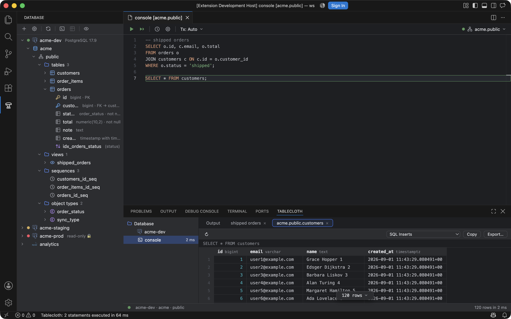
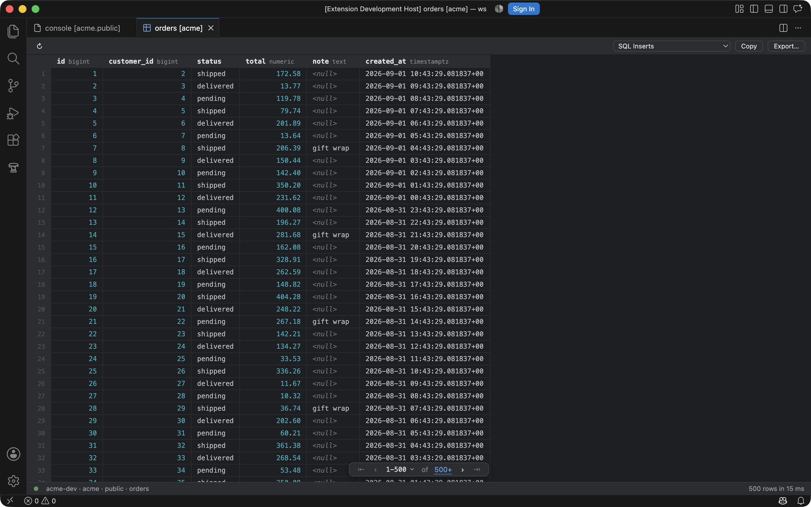
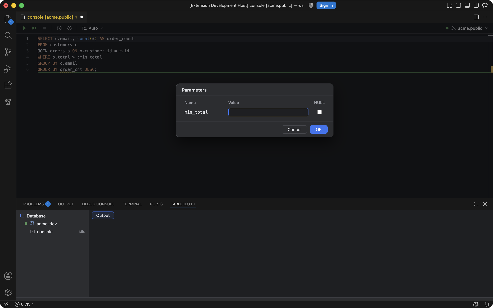
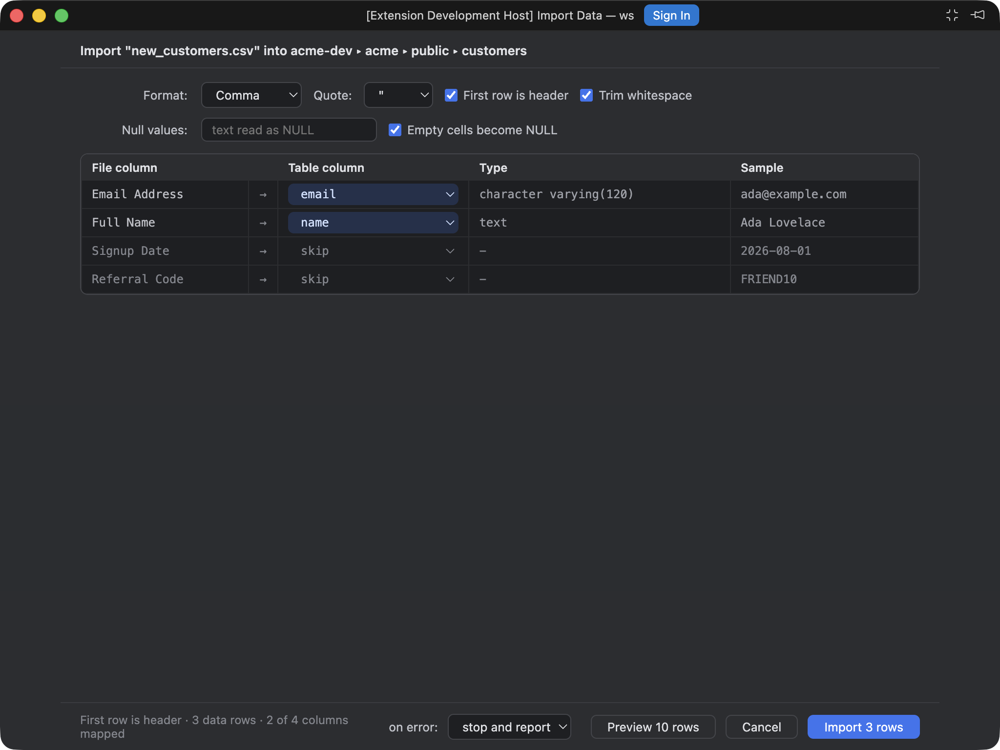
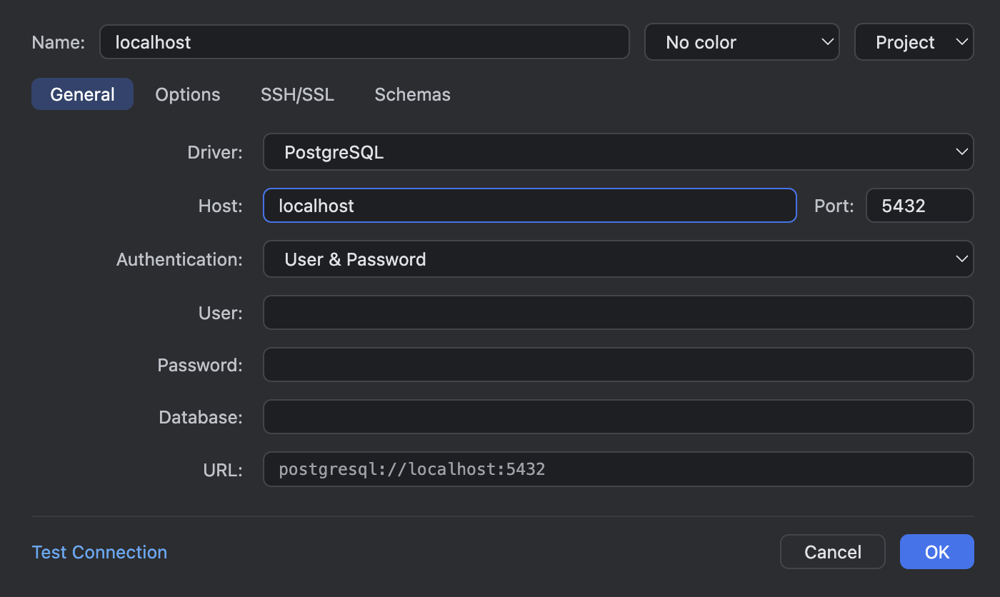

<div align="center">


<h1>Tablecloth</h1>

**IntelliJ-grade database tools, laid over VS Code.**

[](https://vscode.dev/redirect?url=vscode%3Aextension%2Fsultanofcardio.tablecloth)
[](https://marketplace.visualstudio.com/items?itemName=sultanofcardio.tablecloth)
[](https://marketplace.visualstudio.com/items?itemName=sultanofcardio.tablecloth)


</div>

Tablecloth brings the IntelliJ Ultimate **Database Tools** experience to VS Code: connect to PostgreSQL, MySQL/MariaDB, and SQLite, explore schemas in a real tool window, write SQL in consoles with transactions, completion, and inspections, and edit data in a DataGrip-style grid that previews its DML before it runs. Free, open source, and built by someone who did not want to relearn ten years of muscle memory.

> **Preview.** Tablecloth is pre-1.0. Phases 1 and 2 of three have shipped and are used daily, but some rough edges remain and the settings format may change in a minor version before 1.0. See [what works today](#what-works-today), the [known limits](#known-limits), and the [roadmap](https://sultanofcardio.github.io/tablecloth/roadmap.html). The full docs are at [sultanofcardio.github.io/tablecloth](https://sultanofcardio.github.io/tablecloth/).

> Tablecloth is an independent open-source project and is not affiliated with or endorsed by JetBrains or Microsoft. It uses none of JetBrains' code; the running product serves purely as the behavioral spec.

## Installing

[](https://vscode.dev/redirect?url=vscode%3Aextension%2Fsultanofcardio.tablecloth)

The button opens Tablecloth's page inside VS Code; press **Install** there. You can also install from the [Marketplace listing](https://marketplace.visualstudio.com/items?itemName=sultanofcardio.tablecloth) or from a terminal:

```sh
code --install-extension sultanofcardio.tablecloth
```

Drivers ship inside the extension as pure JS/WASM; nothing to compile, nothing to download. A `.vsix` for offline installs is attached to every [GitHub release](https://github.com/sultanofcardio/tablecloth/releases/latest).

## Getting started

1. Open the **Database** view in the activity bar and choose **New Data Source…**.
2. Pick a driver, fill in the connection, and use **Test Connection**. Passwords go to the OS keychain, never to settings.
3. Expand the source in the explorer to browse schemas, tables, keys, indexes, views, sequences, routines, and enum types.
4. Open a **Query Console…** on the source and run the statement at the caret with <kbd>⌘⏎</kbd> / <kbd>Ctrl+Enter</kbd>. Results land in the **Tablecloth** panel, one tab per statement. Statements with `:name` parameters ask for values first.
5. Double-click a table to open its data. Type into cells, add or delete rows, then **Submit** (<kbd>⌘⏎</kbd>) to review the exact DML before it runs. Use the WHERE and ORDER BY fields, the header funnels, and the ↗ on foreign-key cells to move around.
6. <kbd>⌘⇧O</kbd> jumps to any table, column, or routine; right-click any `.sql` file and choose **Run File on Data Source…** to run a script.

## What it looks like

<div align="center">
  
  <br />
  <sub>The explorer, a console bound to <code>acme.public</code>, and the Tablecloth panel: result tabs named after a comment or the queried table, the grid below.</sub>
</div>

<br />

<div align="center">
  
  <br />
  <sub>The data editor: edits accumulate as a change set (blue cells, green added rows, struck-through deletions) and <b>Submit</b> shows the exact UPDATE, DELETE, and INSERT statements before they run, atomically.</sub>
</div>

<br />

<div align="center">
  
  <br />
  <sub>Console intelligence: inspections flag unresolved columns with a Change-to quick fix, and <code>:name</code> parameters get an IntelliJ-style values dialog on run.</sub>
</div>

<br />

<div align="center">
  
  <br />
  <sub>Import Data from File: delimiter detection, column mapping (or a new table from the file), and batched inserts with stop-or-skip on error.</sub>
</div>

<br />

<div align="center">
  
  <br />
  <sub>The Data Sources dialog opens in its own floating window, IntelliJ-style: env colors, Project/Global scope, SSH/SSL tabs, schema selection, Test Connection.</sub>
</div>

## What works today

| Area | Shipped |
| --- | --- |
| Connections | PostgreSQL, MySQL/MariaDB, SQLite · SSH tunnels · SSL modes · user/password, pgpass, no-auth · read-only sources (enforced server-side) · env color labels · Project (workspace, the default) and Global (user) scopes · passwords only in the OS keychain |
| Explorer | Tree in the IntelliJ design language: vendor marks, introspection badges, schemas, tables with PK/FK keys, indexes, views, sequences, routines, enum types · toolbar row · context menus · schema selection and system-schema toggle · auto-sync per source |
| Consoles | Monaco-based editor under an IntelliJ toolbar · run statement with the statement frame · run script · cancel a running statement (⌘F2) · schema switcher that really switches (`search_path`/`USE`) · transaction mode (Auto/Manual) with isolation levels, commit/roll back · per-console sessions · query history · `:name` parameters with a values dialog · consoles persist, rename, and reopen |
| SQL intelligence | Object completion with dialect-correct quoting · keywords and functions · FK-based JOIN clauses and ON conditions · live templates (`sel`, `selw`, `ins`, `upd`, `del`, `tab`, …) · inspections for unresolved tables and columns with Change-to quick fixes · Format SQL (⌘⌥L or Format Document) · Go to Database Object (⌘⇧O) · Go to DDL |
| Results | Tablecloth panel shaped like IntelliJ's Services window: Database → source → console tree, per-console result tabs and Output logs, a data source Information tab · multi-statement runs, one tab per query |
| Data editor | Cell editing with a change set and a DML preview on Submit · add, clone, delete rows · Set NULL / DEFAULT · revert selected or all · Tx mode per data editor with commit and roll back · WHERE and ORDER BY fields with completion · header sort and funnels · FK navigation and referencing rows · value editor (⇧⏎) · transpose, Table / Tree / Text views · column list (⌘F12) · find in page (⌘F) · 500-row pages, floating pager, count on demand |
| Import & export | Import Data from File with column mapping or create-table-from-file · extractors: SQL Inserts / Updates / Where Clause · CSV, TSV, pipe, semicolon · HTML, JSON, Markdown, One-row, Pretty, Python-DataFrame, SQL-Insert-Multirow, XML · Excel (xlsx) through Export Data · copy or export, selection-aware |
| Files | Run any `.sql` file against a chosen source from the explorer context menu |

## Known limits

- Console result grids are editable only for single-table SELECTs whose key columns are in the result; table data editors always are.
- Header funnels list the first 200 distinct values.
- Cancelling a running statement is unavailable for SQLite, which runs in-process.
- MySQL `DELIMITER` blocks are not understood by the statement splitter.
- SQLite empty results lose their column headers.
- Paste in the console uses the keyboard; Monaco's context-menu Paste is inert inside webviews.

Found something else? [Open an issue](https://github.com/sultanofcardio/tablecloth/issues).

## Settings

| Setting | Default | What it does |
| --- | --- | --- |
| `tablecloth.dataSources` | `[]` | Data source definitions, managed through the dialog. Workspace settings hold Project sources (the default when a trusted folder is open); user settings hold Global sources. Passwords are never stored here. |
| `tablecloth.dialogs.openIn` | `floatingWindow` | Open the Data Sources and Import Data dialogs in a separate compact window or as an editor tab. (`tablecloth.dataSourceDialog.openIn` from Phase 1 is still honored.) |
| `tablecloth.grid.pageSize` | `500` | Rows per data grid page; "Set as Default" in the pager menu writes it. |
| `tablecloth.inspections.enabled` | `true` | Flag unresolved tables and columns in consoles and attached SQL files. |
| `tablecloth.explorer.showSystemSchemas` | `false` | Show `pg_catalog`, `information_schema`, `mysql`, `sys`, and friends in the explorer. |
| `tablecloth.export.nullText` | `""` | Text used for NULL values in CSV-family exports. |
| `tablecloth.export.csvQuoteAll` | `false` | Quote every value in CSV-family exports. |

**Workspace trust.** In Restricted Mode, Project data sources are hidden and cannot be created until you trust the workspace. Global data sources, consoles, and the grid work as usual. In virtual workspaces, SQLite files, SSH keys, and CA certificates must live on the local disk.

## Why not SQLTools or Database Client?

Because the parts of Database Tools that matter day-to-day do not exist in any VS Code extension: a reviewable change set with DML preview, transaction control per console and per data editor, result tabs per statement, and a schema-aware editor with FK JOIN inference and inspections, all in the IntelliJ look. The [roadmap](https://sultanofcardio.github.io/tablecloth/roadmap.html) ranks every feature JetBrains documents for Database Tools against what Tablecloth does today, and marks where 1.0 gets cut.

## Development

```sh
npm install
npm run build            # typecheck + bundle to dist/
npm test                 # unit tests + SQLite end-to-end (no external services)
npm run test:integration # PostgreSQL/MySQL driver tests; see test/integration for the docker one-liners
npm run test:vscode      # smoke test inside a real VS Code extension host
npm run lint
npm run package          # build the .vsix
```

Press F5 in VS Code to launch an Extension Development Host with the extension loaded (other extensions disabled). The README screenshots are reproducible via the rig in `scripts/capture/`: the default suite shoots the hero, grid, and dialog; `SHOT_SUITE=phase2.cjs` stages and shoots the data editor, console, and import surfaces (`SHOT_NAMES` narrows either list).

**Docs.** The site at [sultanofcardio.github.io/tablecloth](https://sultanofcardio.github.io/tablecloth/) is built by GitHub Pages from the `gh-pages` branch; edit the Markdown there. The roadmap page is generated, see `_tools/README.md` on that branch.

**Releasing.** CI runs on every push and pull request. To release, move the `Unreleased` section of [CHANGELOG.md](./CHANGELOG.md) under the new version, run `npm version <patch|minor|major>`, and `git push --follow-tags`. The `v*` tag triggers the release workflow, which tests, packages, publishes to the Marketplace, and creates the GitHub release with the `.vsix` attached. The workflow needs a `VSCE_PAT` repository secret.

## Identity

| | |
| --- | --- |
|  | **Icon**: a bistro table wearing its gingham cloth, standing on a database-column pedestal. |
|  | **Activity-bar icon**: 24×24 single-color outline, recolored by VS Code themes. |

Licensed under [MIT](./LICENSE). Bundled third-party assets keep their own licenses; see [THIRD-PARTY-NOTICES.md](./THIRD-PARTY-NOTICES.md).
