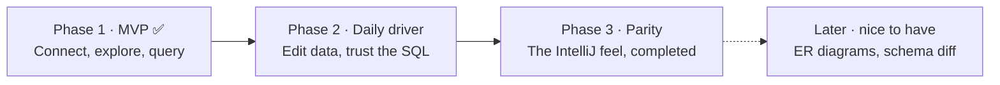

<a name="readme-top"></a>

<div align="center">


<h1>Tablecloth</h1>

**IntelliJ-grade database tools, laid over VS Code.**


</div>

---

Tablecloth is a personal port of the IntelliJ Ultimate **Database Tools** experience to VS Code. One place to connect to your databases, explore their schemas, write SQL in real consoles, and read results in a DataGrip-style grid, without leaving the editor or relearning ten years of muscle memory. Phase 1 is built and released; the [interactive plan](./docs/plan.html) remains the map for what comes next.

> Tablecloth is an independent open-source project and is not affiliated with or endorsed by JetBrains or Microsoft. It uses none of JetBrains' code; the running product serves purely as the behavioral spec.

## Installing

Grab `tablecloth-<version>.vsix` from the [latest GitHub release](https://github.com/sultanofcardio/tablecloth/releases/latest), then:

```sh
code --install-extension tablecloth-0.0.1.vsix
```

(or Extensions view → `…` → *Install from VSIX…*). Drivers ship inside the extension as pure JS/WASM; nothing to compile, nothing to download.

## What it looks like

<div align="center">
  
  <br />
  <sub>The explorer, a console bound to <code>acme.public</code>, and the Tablecloth panel: result tabs named after a comment or the queried table, the grid below.</sub>
</div>

<br />

<div align="center">
  
  <br />
  <sub>Table data: 500-row pages, the floating pager (the range is the page-size menu; <code>500+</code> resolves the exact count on click), sorting, row selection, and extractors in the toolbar.</sub>
</div>

<br />

<div align="center">
  
  <br />
  <sub>The Data Sources dialog opens in its own floating window, IntelliJ-style: env colors, Global/Project scope, SSH/SSL tabs, schema selection, Test Connection.</sub>
</div>

## What's in Phase 1

| Area | Shipped |
| --- | --- |
| Connections | PostgreSQL, MySQL/MariaDB, SQLite · SSH tunnels · SSL modes · user/password, pgpass, no-auth · read-only sources (enforced server-side) · env color labels · Global (user) and Project (workspace) scopes · passwords only in the OS keychain |
| Explorer | Webview tree in the IntelliJ design language: vendor marks, introspection badges, schemas, tables with PK/FK keys, indexes, views, sequences, routines, enum types · toolbar row · anchored context menus · schema selection and system-schema toggle · auto-sync per source (off = introspect only on explicit Refresh) |
| Consoles | Monaco-based console editor under an IntelliJ toolbar · run statement (⌘⏎) with the statement frame · run script · schema switcher that really switches (`search_path`/`USE`) · transaction mode (Auto/Manual) with isolation levels, commit/roll back · per-console sessions · query history · object completion with dialect-correct identifier quoting · consoles persist, rename, and reopen from the console dropdown |
| Results | Tablecloth panel shaped like IntelliJ's Services window: Database → source → console tree, per-console result tabs (comment/table-derived names) and Output logs, a data source Information tab · multi-statement runs, one tab per query |
| Grid | Read-only DataGrip grid: 500-row pages, two-state floating pager, count on demand, sorting, row selection, select-all corner |
| Export | SQL Inserts / SQL Updates / Where Clause · CSV, TSV, pipe, semicolon (configurable null text and quoting) · copy or export, selection-aware |
| Files | Run any `.sql` file against a chosen source from the explorer context menu |

Known Phase 1 limits: the grid is read-only (change sets with DML preview land in Phase 2); MySQL `DELIMITER` blocks are not understood by the statement splitter; SQLite empty results lose column headers; an isolation level is not reapplied after a silent reconnect; paste in the console uses the keyboard (Monaco's context-menu Paste is inert inside webviews).

## Why not SQLTools or Database Client?

Because the parts of Database Tools that matter day-to-day don't exist in any VS Code extension:

| Capability | SQLTools | Database Client | Tablecloth |
| --- | :-: | :-: | :-: |
| Connections & explorer tree | ✅ | ✅ | ✅ deep tree, env colors, read-only mode |
| Schema-aware SQL completion | 🟡 basic | 🟡 basic | ✅ live schema, quoted identifiers (JOIN inference in Phase 2) |
| Transaction control | ❌ | ❌ | ✅ Tx mode + isolation per console |
| Result tabs per statement | ❌ | ❌ | ✅ IntelliJ-style named tabs |
| Editable data grid | ❌ | 🟡 immediate edits | 🔜 Phase 2: batched change set + DML preview |
| Explain plan visualization | ❌ | ❌ | 🔜 Phase 3 |
| IntelliJ look & feel | ❌ | ❌ | ✅ styled after the New UI, down to the pager |

## Roadmap



| Phase | Scope | Exit test |
| --- | --- | --- |
| **1 · MVP** ✅ | Connections, explorer, consoles (with transactions, history, and schema switching pulled forward), read-only grid, extractors, run `.sql` files | A normal day of database work happens in VS Code; the JetBrains icon stays in the dock, unclicked |
| **2 · Daily driver** | Editable grid with change sets and DML preview, WHERE/ORDER BY + header filters, FK navigation, deep completion and inspections, import wizard | IntelliJ muscle memory mostly works; nothing used weekly is missing |
| **3 · Parity** | Object editor dialogs, dump/restore, visual explain plan + EXPLAIN ANALYZE, sessions viewer, full-text data search, find usages, rename refactor, CSV file viewer/editor ("Edit as Table…") | Nothing left that makes you reinstall IntelliJ |
| **Later** | ER diagrams, schema diff + migration scripts, extra drivers | Only if a real need appears; nothing depends on these |

The [interactive plan](./docs/plan.html) carries the full 55+ item parity checklist and the mock-ups that Phase 1 was built against.

## Development

```sh
npm install
npm run build            # typecheck + bundle to dist/
npm test                 # unit tests + SQLite end-to-end (no external services)
npm run test:integration # PostgreSQL/MySQL driver tests; see test/integration for the docker one-liners
npm run test:vscode      # smoke test inside a real VS Code extension host
npm run lint
npm run package          # build the .vsix
```

Press F5 in VS Code to launch an Extension Development Host with the extension loaded (other extensions disabled). The README screenshots are reproducible via the rig in `scripts/capture/`.

## Identity

| | |
| --- | --- |
|  | **Icon**: a bistro table wearing its gingham cloth, standing on a database-column pedestal. |
|  | **Activity-bar icon**: 24×24 single-color outline, recolored by VS Code themes. |

Licensed under [MIT](./LICENSE). Bundled third-party assets keep their own licenses; see [THIRD-PARTY-NOTICES.md](./THIRD-PARTY-NOTICES.md).
