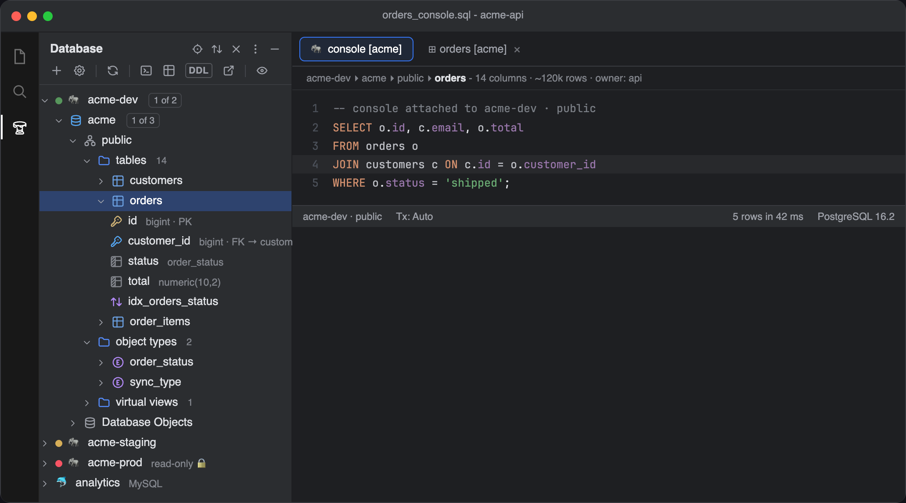
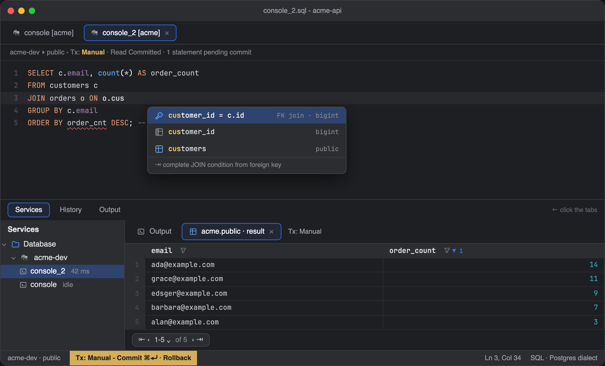
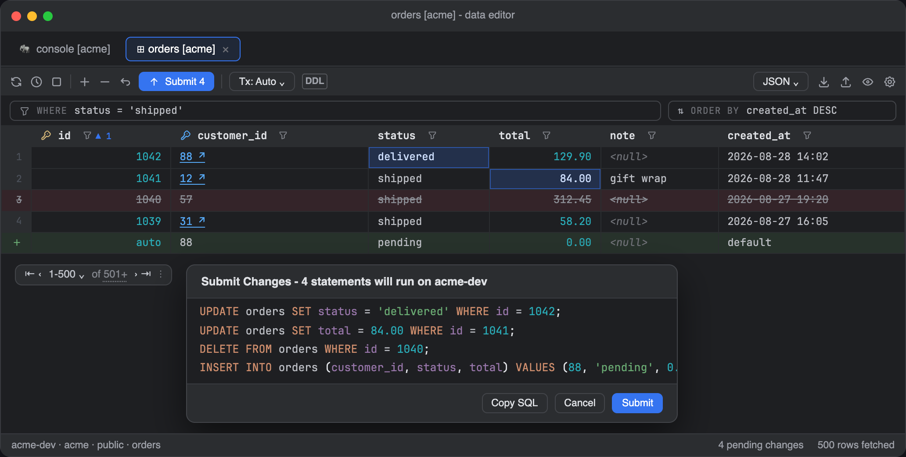
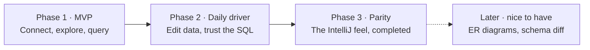

<h1>Tablecloth</h1>

**IntelliJ-grade database tools, laid over VS Code.**

---

Tablecloth is a personal port of the IntelliJ Ultimate **Database Tools** experience to VS Code. One place to connect to your databases, explore their schemas, write SQL with real schema-aware intelligence, edit data in a DataGrip-style grid with reviewable change sets, and manage DDL, all without leaving the editor or relearning ten years of muscle memory.

**📐 [Read the full plan with interactive mock-ups](./docs/plan.html)**: download and open locally, or view via [githack](https://raw.githack.com/) once the repo is public. Every major surface is mocked up in IntelliJ's New UI design language.

> Tablecloth is an independent open-source project and is not affiliated with or endorsed by JetBrains or Microsoft. It uses none of JetBrains' code; the running product serves purely as the behavioral spec, and internals are built on open components (libpg_query, ANTLR SQL grammars, existing SQL language servers).

## A first look

  
   
  The Database tool window: env-colored data sources, deep object tree, and a console bound to a schema.

 

  
   
  Schema-aware completion with FK-based JOIN inference, inspections, and the Services tool window with the result grid.

 

  
   
  The data editor: batched change set with blue updates, green inserts, struck-through deletes, and a DML preview before anything is submitted.

## Familiar workflow, new editor

| IntelliJ Database Tools | Tablecloth in VS Code |
| --- | --- |
| Database tool window | Full object tree (schemas, tables, columns with PK/FK, indexes, object types) with introspection badges, env colors, and read-only guards |
| Data Sources and Drivers | Connection dialog with General/Options/SSH-SSL tabs, per-source color, transaction control, keep-alive, auto-sync introspection |
| Query console | Consoles bound to a source and schema: run statement/selection/file, FK-aware JOIN completion, inspections, format, history, output log |
| Data editor | 500-row pages with count-on-demand, WHERE/ORDER BY fields, header filters, batched change set with DML preview before submit |
| Tx control | Auto/Manual commit per console, isolation levels, commit/rollback in the status bar |
| Data extractors | SQL Inserts/Updates, Where Clause, CSV family, JSON, Markdown, HTML, XML, scripted extractors |
| Import Data | CSV import wizard with column mapping and create-table-from-file |

## Why not SQLTools or Database Client?

Because the parts of Database Tools that matter day-to-day don't exist in any VS Code extension:

| Capability | SQLTools | Database Client | Tablecloth (target) |
| --- | :-: | :-: | :-: |
| Connections & explorer tree | ✅ | ✅ | ✅ deep tree, env colors, read-only mode |
| Schema-aware SQL completion | 🟡 basic | 🟡 basic | ✅ live schema, JOIN inference, inspections |
| Editable data grid | ❌ | 🟡 immediate edits | ✅ batched change set + DML preview |
| Transaction control | ❌ | ❌ | ✅ Tx mode + isolation per console |
| Import / export wizards | 🟡 | 🟡 | ✅ full extractor set + guided import |
| Explain plan visualization | ❌ | ❌ | ✅ plan tree with cost hotspots |
| IntelliJ look & feel | ❌ | ❌ | ✅ styled after the New UI |

## Roadmap

| Phase | Scope | Exit test |
| --- | --- | --- |
| **1 · MVP** | Connections (PostgreSQL, MySQL/MariaDB, SQLite; SSH/SSL, pgpass), explorer tree, query console with object completion, read-only 500-row grid, core extractors, run `.sql` files | A normal day of database work happens in VS Code; the JetBrains icon stays in the dock, unclicked |
| **2 · Daily driver** | Editable grid with change sets and DML preview, WHERE/ORDER BY + header filters, FK navigation, deep completion and inspections, Tx modes + isolation, history and output log, import wizard | IntelliJ muscle memory mostly works; nothing used weekly is missing |
| **3 · Parity** | Object editor dialogs, dump/restore, visual explain plan + EXPLAIN ANALYZE, sessions viewer, full-text data search, find usages, rename refactor | Nothing left that makes you reinstall IntelliJ |
| **Later** | ER diagrams, schema diff + migration scripts, extra drivers | Only if a real need appears; nothing depends on these |

<b>Full parity checklist (55+ features)</b>

| Area | Features |
| --- | --- |
| **Connections** | Data source manager (Global + Project) · driver auto-download · SSH tunnel · SSL · user/password, pgpass, no-auth · read-only flag · env color labels · schema selection · auto-sync/manual re-introspection · keep-alive & auto-disconnect · startup script · per-source console files · DDL data source |
| **Explorer & navigation** | Full object tree (tables, columns, PK/FK, indexes, views, sequences, routines, object types) · introspection count badges · tree filter & visibility options · quick documentation · go to object · view DDL · find usages · drop/rename with usage check · favorites |
| **Console & assistance** | Run statement/selection/file · multiple consoles · object completion · per-dialect highlighting · context-aware completion · FK JOIN completion · inspections & quick fixes · format SQL · query history · output/audit log · parameters dialog · Tx auto/manual + isolation · kill query · live templates · rename refactor · run procedure with params |
| **Data editor** | 500-row pages + page-size menu · count on demand · virtualized rendering · sort via ORDER BY · change set + DML preview · submit/revert · add/delete/clone rows · WHERE/ORDER BY fields · per-column filters · FK navigation · value editor · transpose + Table/Tree/Text views · hide/reorder columns · view query · aggregate view · compare result sets · full-text search |
| **Import / export** | SQL Inserts/Updates/Where Clause · CSV/TSV/pipe/semicolon + format config · JSON, Markdown, HTML, XML, Pretty, One-row, Python-DataFrame · copy-as · CSV import wizard · create table from file · Excel via Export Data · custom scripted extractors |
| **Schema management** | Run `.sql` against a source · generate DDL · Modify Table/Column/Index dialogs · dump & restore · *(later)* schema diff · *(later)* migration scripts |
| **Insight** | Visual explain plan · EXPLAIN ANALYZE · sessions/activity viewer · *(later)* ER diagrams |

Deliberately out of scope: Oracle, MongoDB, and other drivers until a real need appears, and IntelliJ's injected-SQL-in-code-strings analysis.

## Identity

| | |
| --- | --- |
|  | **Marketplace icon**: a bistro table wearing its gingham cloth, standing on a database-column pedestal. |
|  | **Activity-bar icon**: 24×24 single-color outline (`currentColor`), recolored by VS Code themes. |

## Status

Planning. The [interactive plan](./docs/plan.html) is the source of truth for scope and sequencing; building starts with Phase 1. Free on the marketplace when it ships: built for one person's daily workflow, published for anyone else who cares.

Licensed under [MIT](./LICENSE). Bundled third-party assets keep their own licenses; see [THIRD-PARTY-NOTICES.md](./THIRD-PARTY-NOTICES.md).
