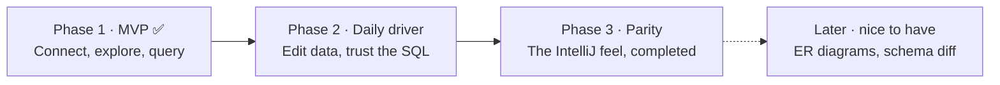

# Roadmap

Tablecloth is a port of the IntelliJ Ultimate **Database Tools** experience to VS Code, built in three phases. Phase 1 has shipped; the extension stays in preview (pre-1.0) until Phase 2 lands and the settings format is considered stable.

The [interactive plan](./docs/plan.html) carries the full 55+ item parity checklist and the mock-ups that Phase 1 was built against. Open it from a checkout; GitHub shows the raw HTML.

| Phase | Scope | Exit test |
| --- | --- | --- |
| **1 · MVP** ✅ | Connections, explorer, consoles (with transactions, history, and schema switching pulled forward), read-only grid, extractors, run `.sql` files | A normal day of database work happens in VS Code; the JetBrains icon stays in the dock, unclicked |
| **2 · Daily driver** | Editable grid with change sets and DML preview, WHERE/ORDER BY + header filters, FK navigation, deep completion and inspections, import wizard | IntelliJ muscle memory mostly works; nothing used weekly is missing |
| **3 · Parity** | Object editor dialogs, dump/restore, visual explain plan + EXPLAIN ANALYZE, sessions viewer, full-text data search, find usages, rename refactor, CSV file viewer/editor ("Edit as Table…") | Nothing left that makes you reinstall IntelliJ |
| **Later** | ER diagrams, schema diff + migration scripts, extra drivers | Only if a real need appears; nothing depends on these |

## Phase 1 in detail

| Area | Shipped |
| --- | --- |
| Connections | PostgreSQL, MySQL/MariaDB, SQLite · SSH tunnels · SSL modes · user/password, pgpass, no-auth · read-only sources (enforced server-side) · env color labels · Global (user) and Project (workspace) scopes · passwords only in the OS keychain |
| Explorer | Webview tree in the IntelliJ design language: vendor marks, introspection badges, schemas, tables with PK/FK keys, indexes, views, sequences, routines, enum types · toolbar row · anchored context menus · schema selection and system-schema toggle · auto-sync per source (off = introspect only on explicit Refresh) |
| Consoles | Monaco-based console editor under an IntelliJ toolbar · run statement (⌘⏎) with the statement frame · run script · schema switcher that really switches (`search_path`/`USE`) · transaction mode (Auto/Manual) with isolation levels, commit/roll back · per-console sessions · query history · object completion with dialect-correct identifier quoting · consoles persist, rename, and reopen from the console dropdown |
| Results | Tablecloth panel shaped like IntelliJ's Services window: Database → source → console tree, per-console result tabs (comment/table-derived names) and Output logs, a data source Information tab · multi-statement runs, one tab per query |
| Grid | Read-only DataGrip grid: 500-row pages, two-state floating pager, count on demand, sorting, row selection, select-all corner |
| Export | SQL Inserts / SQL Updates / Where Clause · CSV, TSV, pipe, semicolon (configurable null text and quoting) · copy or export, selection-aware |
| Files | Run any `.sql` file against a chosen source from the explorer context menu |

## Known Phase 1 limits

- The grid is read-only; change sets with DML preview land in Phase 2.
- MySQL `DELIMITER` blocks are not understood by the statement splitter.
- SQLite empty results lose their column headers.
- An isolation level is not reapplied after a silent reconnect.
- Paste in the console uses the keyboard; Monaco's context-menu Paste is inert inside webviews.

## How Tablecloth compares

| Capability | SQLTools | Database Client | Tablecloth |
| --- | :-: | :-: | :-: |
| Connections & explorer tree | ✅ | ✅ | ✅ deep tree, env colors, read-only mode |
| Schema-aware SQL completion | 🟡 basic | 🟡 basic | ✅ live schema, quoted identifiers (JOIN inference in Phase 2) |
| Transaction control | ❌ | ❌ | ✅ Tx mode + isolation per console |
| Result tabs per statement | ❌ | ❌ | ✅ IntelliJ-style named tabs |
| Editable data grid | ❌ | 🟡 immediate edits | 🔜 Phase 2: batched change set + DML preview |
| Explain plan visualization | ❌ | ❌ | 🔜 Phase 3 |
| IntelliJ look & feel | ❌ | ❌ | ✅ styled after the New UI, down to the pager |
